  <!-- Header Animation (Cobalt Theme) -->
  

  <!-- Typing Effect -->
  

   

  <!-- Music Player -->
  

    

  <!-- Bio Section -->
  <h3>👨‍💻 About Me</h3>
  

    My coding journey began with a fascination for <b>Cybersecurity</b>, which evolved into a career in full-stack engineering. 
    I am constantly exploring new technologies to build smarter, safer applications.
  

  <!-- Interest Badges -->
  

    
    
    
    
    
  

   

  <!-- Stats Section (Color Matched) -->
  

    
  

   

  <!-- Skills Section -->
  <h2>🛠️ Tech Stack</h2>

  <!-- Languages -->
  
  
  
  
  
  
    

  <!-- Frameworks -->
  
  
  
  
  

    

  <!-- Tools -->
  
  
  
  

    

  <!-- Databases -->
  
  
  
  <!-- Convex Custom Badge -->
  

    

  <!-- Contact Section -->
  <h3>📬 Connect with Me</h3>
  
  
  

    
  
  <!-- Footer Image -->
  

